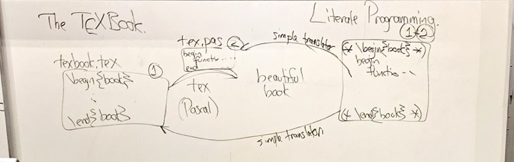

# Lecture 1

## Some History

D.E. Knuth: The Art of Computer Programming \(TAoCP\)

* book includes math + software + English
* language for writing books
* developed TeX
  * Pascal for formatting math formulas
  * Wrote a book _The TeXBook_
  * Problem: two files to maintain
    * u have to change both the source code and the file for modification 

### **Literate Programming:**

* Only one source file needed 
* text-directed, simple translator 
* But in Pascal, you have to declare a function before using it. So he also wrote a simple Pascal translator



M.D. McIlroy \(Bell Labs\)

* pipes in sh
* hash trie \(trie: sorta binary tree but not binary\)
* shell 

```
tr -cs -s 'A-Za-z' '[\n]x' | sort | uniq -c | sort -nr
```

* Complement, replace space with new line, and squeeze
* sort and place duplicate into each other
* throw away duplicates; at the front of output lines, put a count
* sort numerically in reverse order


😇 Choice of notation matters


### **Sapir-Whorf Hypothesis**

* Structural diversity of \(natural\) languages is essentially limitless.
  * natural language is recursive \(sometimes\)
* The language we use, to some extent, ~~determines~~ affects how we view the world, and how we think.

### IEEE Spectrum Top Programming Languages 2019

|  | \*\*\*\* | \*\*\*\* |
| :--- | :--- | :--- |
| 1 | **Python** | 100.0 |
| 2 | **Java** | 96.3 |
| 3 | C | 94.4 |
| 4 | C++ | 87.5 |
| 5 | R | 81.5 |
| 6 | JavaScript | 79.4 |
| 7 | C\# | 74.5 |
| 8 | Matlab | 70.6 |
| 9 | Swift | 69.1 |
| 10 | Go | 68.0 |
| 14 | Assembly | 63.7 |
| 22 | Shell | 52.2 |
| 39 | Scheme | 27.0 |
| 46 | Prolog | 23.5 |
| 48 | **Ocaml** | 16.0 |

## Language Design Principles

* Orthogonality
  * Every axis is independent and you can make a choice on one axis without worrying what you choose on the other axis.
  * Examples of non-orthogonality

    In C, functions can return any values except arrays. Because when working on 16-bit machine, if you return a gigantic array, it explodes. It is not orthogonal because there are some types that you cannot return in a function.

  * You would rather choose a language that is orthogonal, because it does not have these edge restrictions and exception cases and it is a lot simpler. 
* Efficiency \(time/space/power/network access\)
* Simplicity 
  * easy to learn, remember and implement
  * Compare \(\* \(+ 3 4\) 5\) and 3 4 + 5 \*, you need to give up something to get a simple language
* Convenience
* Familiarity
* Safety
  * Error check at run time or compile time, or no checking

```
char c;
int *p = &c;
*p = 10000;
/*compile time error*/
```

* Mutability
  * How well does the language support changes to your program or to the language itself. Successful languages evolve. Want to make changes to the language without breaking previous code. You want to go for languages that will encourage evolving.

