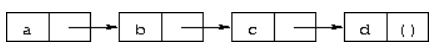

# Lecture 12 Scheme

## Scheme

* Teaching subset of Lisp and not exactly a subset \(differs\)
* Lisp has been a very popular AI language
* Traditional AI - NOT machine learning
* Based on logic and arithmetic
* A language that has a long tradition in computer science and ideas that when they were first introduced were considered way too bleeding-edge and inefficient
* Slow, academic side of things
* Too slow for academic use
  * The relative inefficiency that sometimes remains results from **run-time checks that support generic arithmetic and help programmers detect and correct various common programming errors.**

## Advantages of Scheme

### Tail recursive

### Has floating point numbers

### Scheme is OO in some sense

* Scheme values are **all Objects** in the OO programming sense
* **Have pointers and addresses**
* Dynamically allocated so program can allocate an Object whenever it feels like and calls the equivalent of “new” whenever it wants
* They are never freed, so the program never has to free an object
* Up to the system of when to handle this condition

### Concept of Garbage Collector

* Like M.L., OCaml, Java, Python
* Unlike C++, C
* Dynamically allocated and retained until no longer needed, then automatically deallocated.
* Simple atomic values, such as small integers, characters, booleans, and the empty list, are typically represented as immediate values and thus incur no allocation or deallocation overhead.
* **First-class data type**
  * retained indefinitely
  * may be passed freely as arguments to procedures, returned as values from procedures, and combined to form new objects \(see textbook summary\)

### Types in Scheme:

* Everything is an object in Scheme including integers!
* Objects at runtime have types
* They belong to object values
*  Manifest types are obvious if you read the program, you can just see it!

### Dynamic Checking 

* Do dynamic type checking here, not static type checking.
* Scheme is like Python which does dynamic type checking but unlike OCaml, Java, C, C++ in terms of interpreted side rather than compiled side

### Scope checking

**static scoping**

* Scope checking - we want to do all that checking at compile-time
* Use caller’s names to resolve things you don’t know
* very simple scoping strategy that means you don't know what X means until runtime


#### Q. What if you have two variables with the same name?

A. That would be an error in scope.


* You look at the closest call and this is like static scoping in C

#### Bash uses dynamic scoping for environment variables

* In CS 35L, we constantly tell you to set the PATH environment variable so you can run a shell script to run the value of that variable
* **Performance issue for scoping \(Scheme doesn’t use this!\)**
* **Advantage of static scoping is speed!**
* **Misspellings in the program are also checked before it runs in static scoping**


#### Q. Why would you want dynamic scoping?

A. Lessens the number of arguments at runtime. Like setting the PATH environment  
variable modifies all of your shell scripts. Set your PATH variable to use your version of  
grep.


* Gives you extra flexibility and another way to modify the behavior of programs besides the standard ones \(passing in extra arguments\)
* call by value
* Evaluate the argument, get a value, and pass a copy of that value \(a copy of the pointer to an object\) to the called function
* Objects of procedure types are first-class objects
* Same namespace and values as everything else
* All of this is the same to Scheme and we don’t have a special sort of case for procedures

### Continuations

* A special subset of procedures 
* Not functions
* Procedures you create and they immediately represent the entire future of your program which you later replay
* like snapshots but not really snapshots
* A continuation is a procedure that embodies the remainder of a program at a given point in the program. A continuation may be obtained at any time during the execution of a program. As with other procedures, a continuation is a first-class object and may be invoked at any time after its creation. Whenever it is invoked, the program immediately continues from the point where the continuation was obtained. **Continuations allow the implementation of complex control mechanisms including explicit backtracking, multithreading, and coroutines.**
* NOT like POSIX threads but use these in other kinds of languages
* **A multi-threaded application is modeled as a bunch of continuations**
* Append continuation to the current list of processes

Scheme is about stripping down a language to the smallest primitives you can so you can understand the key concepts of the language rather than gingerbread.

We call the continuation function and pass in the value.


## Lisp

Metaprograms has made it survive for many years

* **tail-recursive** optimization is required
* call zillions of f until you call h
* Stack size proportional to recursion depth, so you will have problem if you try to concatenate a list of one million
* Depth of the stack is bounded

### High level arithmetic

* Take an integer and keep squaring it, multiply it then by itself. What will happen?
  * run out of memory
  * You won’t have an integer overflow, but you can generate data so big that it doesn’t fit into RAM
  * The only thing that can go wrong where the code doesn’t match math is that you can exhaust memory 

## Difference between Scheme and Lisp

* Heavy emphasis on static scoping for scheme. Common Lisp has a bigger library and intended for production code
* Scheme was intended to be more stripped down
* A big AI system would use common lisp probably

### Syntax identifier

* Keyword, variables and symbols
* "\*" is used in scheme all the time 
* Not a built-in operator, but rather a function in standard library
* Don't allow +,-,., or digit to start an identifier
* This sort of freedom of identifiers will let you do all sorts of stuff
* By convention, identifiers ending in ? are **predicates**
  * eq?
  * functions that return boolean
* Identifiers are case-sensitive
* The names of procedures and syntactic forms that **cause side effects** end with an exclamation point \( ! \). These include set! and vector-set!. Procedures that perform input or output technically cause side effects, but their names are exceptions to this rule.
* &syntax violation:
  * describe a situation in which a program is malformed. Syntax violations are detected prior to program execution. When a syntax violation is detected, an exception of type &syntax is raised and the program is not executed.
  * **occurs if the structure of a syntactic form does not match its prototype.** 
  * Similarly, an exception with condition type &assertion is raised if the number of arguments passed to a standard procedure does not match what it is specified to receive. 
  * An exception with condition type &assertion is also raised if a standard procedure receives an argument whose type is not the type implied by its name or does not meet other criteria given in the description of the procedure.

## Scheme Basics

### Interacting with Scheme 

Read-evaluate-print loop \(REPL\): an interactive environment that reads each expressions, evaluates it, and prints out value 

While Scheme provides various input and output procedures, the REPL takes care of reading expressions and printing their values. This frees you to concentrate on writing your program without worrying about how its results will be displayed.

* Prefix notation
* _define_ establishes variable-bindings

### Quote

* forces the list to be treated as data
* a quoted expression is not a procedure expression
* quoting an identifier tells scheme to treat the identifier as a symbol rather than a variable

### Lists

* \( l i s t . s \)
* \(\) : empty list
* Improper list
  * \( a b . c\)
  * . is just syntax like a parentheses to represent this notion
* Data structure built out of pairs except the last item isn’t nil
* Proper list
* car cdr cons
  * the procedure cons actually builds pairs, and there is no reason that the cdr of a pair must be a list. A list is a sequence of pairs; each pair's cdr is the next pair in the sequence.



* null? returns \#t if its argument is the empty list \(\), and \#f otherwise

### Booleans

* \#t, \#f
* \#f is the only false value

### Recursion and Iteration

#### let 

syntax: _\(let name \(\(var expr\) ...\) body1 body2 ...\)_

```text
(define divisors
  (lambda (n)
    (let f ([i 2] [ls '()])
      (cond
        [(>= i n) ls]
        [(integer? (/ n i)) (f (+ i 1) (cons i ls))]
        [else (f (+ i 1) ls)]))))
```


|  |  |
| :--- | :--- |


