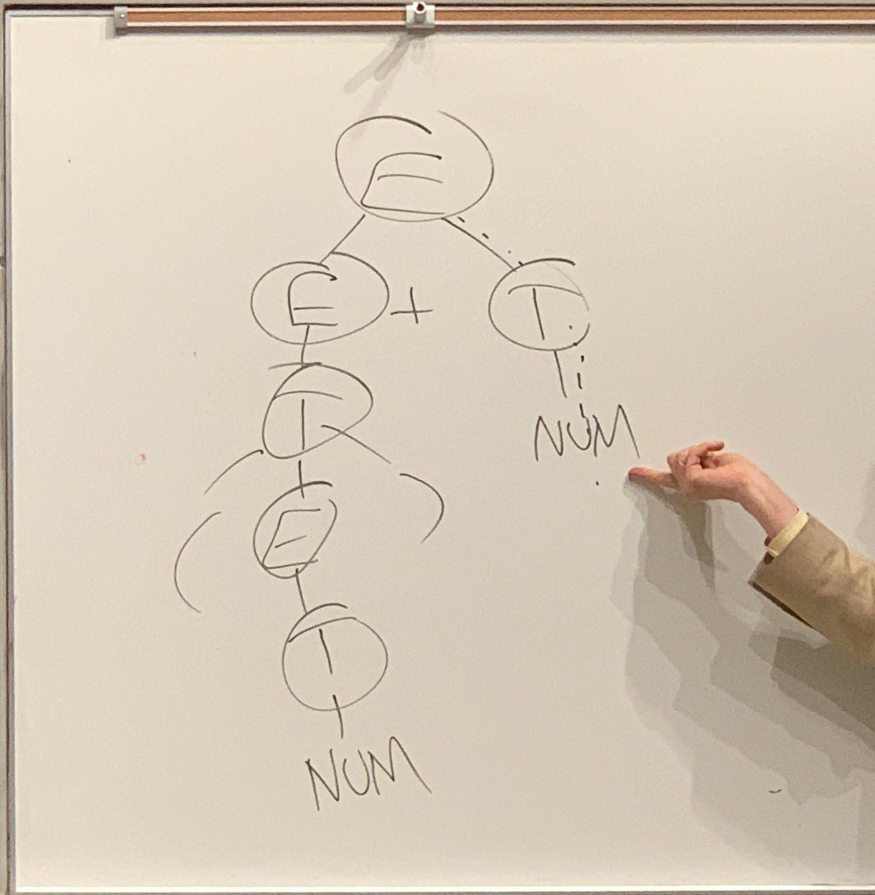
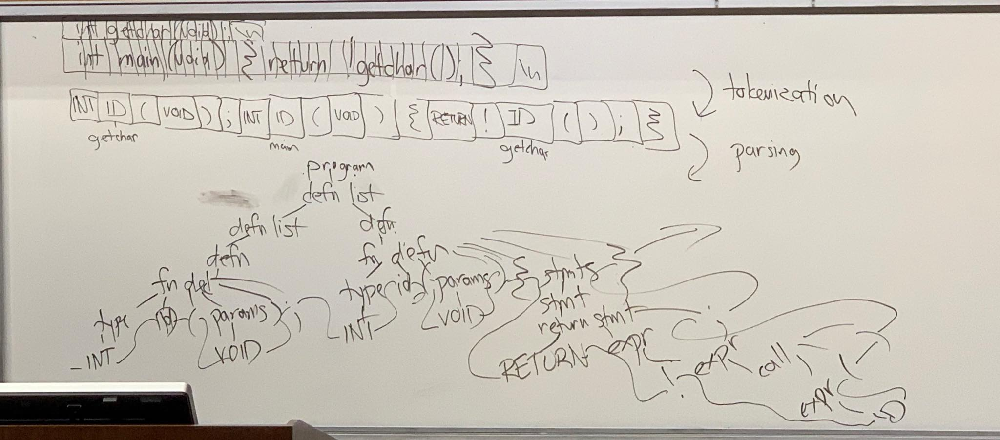

# Lecture 3

## Tokenization, Scanning, Lexing

list of tokens -&gt; parse tree

### Context-Free Grammar

bunch of rules, each rule specifies a possible internal node in a parse tree

* finite sets of tokens, or terminal symbol
* finite sets of non-terminal symbols \(disjoint from set \#1\)
* finite sets of rules
  * LHS: non-terminal
  * RHS: finite sequence of symbols \(children of LHS\) \(possibly empty\)
* Start symbol, non-terminal


Language = set of sentences

Sentence = finite sequence of tokens

Token = finite set





```text
{E -> E+T,
 E -> T,
 T -> ( E ),
 T -> NUM}
 
 start symbol E,
 nonterminal = {E,T}
 terminals = {(,NUM,)}
 
```

### Properties

* Grammars are recursive 

### Trouble with grammars

* non-terminal is defined but not used =&gt; useless
  * defined: on LHS
  * used: on RHS or as start symbol
  * \(it is not useless when a token is a start symbol\)
*  non-terminal is used but not defined

  ```text
  E -> E + T
  E -> T
  T -> T * F    (F is not defined anywhere, but it is a non-terminal)
  T -> (E)
  T -> NUM

  ```

  Example: "software tools" approach \(Bell Labs 1970s\)

  ```c
  int getchar(void);
  int main(void) {return !getchar();}
  /* preprocessing */
  /* tokenization
  INT ID(getchar) ( VOID ); INT ID(main) ( VOID ) {
  RETURN ! ID(getchar) ( ) ; }
  */
  /* parsing: see fig1 below */
  /* checking type scope */
  /* intermediate code generation
    main: push getchar
    call
    !
    ret */
  /* target code generation 
  main:
    call getchar
    tstl %eax, %eax
    setz %al
    ret
  */
  ```



* Cnt'd example

  * Pros: divide and conquer
  * Cons: hard to debug

  Example2: "IDE" Integration Development Environments \(Xerox PARC 1970\)

* useless rules
* extra constraints not captures by grammar 

  * scope check
  * type check

  ```text
  non-terminals {S, NP, VP}
  terminals {., N, Adj, V, Adv}
  S -> NP NP.
  NP -> N
  NP -> Adj N
  VP -> V
  VP -> VP Adv

  Problems: 
      Dogs walk. (ok)
      Fido sleeps soundly. (ok)
      Dogs sleeps soundly. (not ok)
  ========================================
  non-terminals {S, PNP SNP, PVP, SVP}
  terminals {., PN, SN, Adj, PV, SV, Adv}
  S -> SNP SNP.
  S -> PNP PVP.
  ......

  Problems:
      Grammar rules grow exponentially when we 
      add more constraints.
  ```

* too much detail in your grammar 
* ambiguous grammar

  ```text
  E -> E + E
  E -> E * E
  E -> ID
  E -> NUM
  E -> (E)

  2 + 3 * 4
  (E + (E * E))
  ((E + E) * E)
  ```


