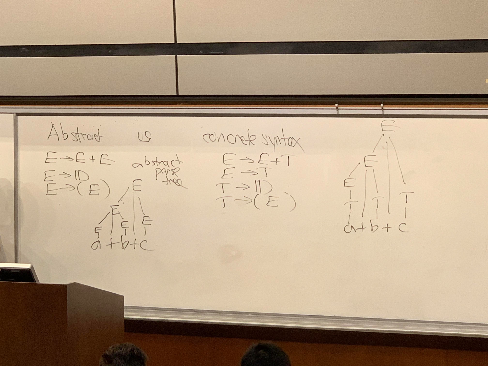

# Lecture 4

syntax

-&gt; grammar

--&gt; ambiguity

---&gt; precedence & associativity

--&gt; notation

## Ambiguity

```text
stmt:
    ;
    expr;
    return expr;
    break;
    continue
    goto ID;
    {stmt list};
```

```text
/* An example of ambiguity: dangling else */
if (expr) stmt
if (expr) stmt else stmt
while (expr) stmt
do stmt while (expr);

/* One fix*/
if (expr) stmt
while (expr) stmt
do stmt while (expr);
------
stmt: if (expr) stmt1 else stmt2
        stmt2
```

### Dangling "else"

```cpp
if (a<b) if (c<d) a++; else b++;
```

There are two ways of parsing it:

* ```cpp
  if (a<b) 
      {if (c<d) 
          a++;
      else b++;}
  ```
* ```cpp
  if (a<b) 
      {if (c<d) 
          a++;}
  else b++;
  ```

### Question: Is the grammar of Ocaml ambiguous?

* At least for each if statement, we must have an else in Ocaml.
* But function calls:

  ```ocaml
  f x y;;
  f g x y;;
  ```

  Because Ocaml function application is always **left-associated,** 

  ```ocaml
  f g x y -> ((f g) x) y
  ```

#### What about match statement in Ocaml?

```ocaml
match E with
|P1 -> E1
|P2 -> match F with
    | P3 -> E3
    | P4 -> E4 (*Becuase space does not matter,
                we have a dangling match problem*)

(*Dangling match version 2*)
match E with
|P1 -> E1
|P2 -> match F with
    | P3 -> E3
| P4 -> E4
```

* There might be a **"dangling match"** problem with Ocaml. With the above example, we don't know which P4 matches to. 

### Abstract vs Concrete syntax

#### Abstract

* ```text
  E -> E + E
  E -> ID
  E -> (E)
  ```

#### Concrete syntax

* ```text
  E -> E + T
  E -> T
  T -> ID
  T -> (E)
  ```



"parser generators"

"compiler-computers"

grammar -&gt; parser 

* Example: Prolog operator declarations

  ```text
  :-op(500, yfx, [+,-])
  :-op(400, yfx, [*,/])
  :-op(200, xfy, [**])
  :-op(200, fx, [+,-])
  :-op(700, xfx, [=,\=,==,=<,..]) /*xfx: x on both
                                    sides, so non-associate*/
  :-op(200, yf, [!])

  /* yfy not allowed*/
  ```

* Example": associativity in C/C++ 

  **left-associate**

  ```cpp
  if (a<b<c) 
      i++;
  /* This is a valid c/c++ code, because c/c++ 
   is left associate*/
  if ((a<b)<c)
      i++;
  if (a==b==c==d) /*also valid in c/c++*/    
  ```

## Notation

**Internet RFC 5322** \(RFC: request for comment\)

grammar for header

* msg ID: each email has a UNIQUE msg ID 

  ```text
  msg-id="<"word *("." word) "@" atom *("." atom)">"
                  /*0 or more words*/ 
  ```

  * **Meta-notation in grammars** \(not part of standard grammar\)
    * F\* : 0 or more instances of F
    * F/G
    * F+ \(one or more instances of sth\)

  Meta-notations in the above msg-id

  ```text
  word=atom / quoted-string
  atom=1*<any CHAR except specials, space and CTLs>
    CHAR = any ASCII char
    specials = () <> @ , ; : \ " . [] 
    CTLs = \0 _\037 \177(DEL)
  quoted-string = <">*(qtext/quoted-pair)<">
  qtext = <any CHAR except "\CR>
  quoted-pair = "\" CHAR
  ```

  * Meta-notations can nest in other meta-notations

**ISO standard for EBNF**  

EBNF: extended \(meta-notation\) Backus-Naur Form

```text
nonterminal -> (nonterminal | terminal)*

```

EBNF form of msg-id:

```text
msg-id = "<" word dot-words "2" atom dot-atoms ">"
dot-words = "." word dot-words
dot-words = 
dot-words = "." atoms dot-atoms
dot-atoms = 

```

### ISO EBNF

| "terminal" | 'terminal' |
| :--- | :--- |
| \[ option \] | 0 or 1 |
| { repetition } | 0 or more |
| \( grouping \) | 1 |
| \(\* comment \*\) |  |

| Notation \(decreasing precedence\) | Meaning |
| :--- | :--- |
| A\* | repetition \(0 or more\) |
| A-B | exception \(set difference\) |
| A,B | concatenation |
| A\|B | or |
| lhs = rhs; | grammar rules |

### Grammar rules in ISO EBNF

* syntax = syntax rules, {syntax rule};
* syntax rule = meta id, '=', defn list, ';' ;
  * This grammar rule specifies its own syntax
* defn list = defn, { '\|' , defn }; 
  * \(defn separated by \|\)
* defn = term, { ',' , term };
* term = factor, \[ '-' , exception \];
* 
