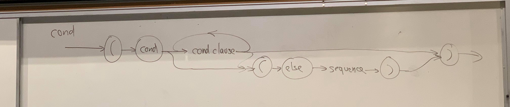
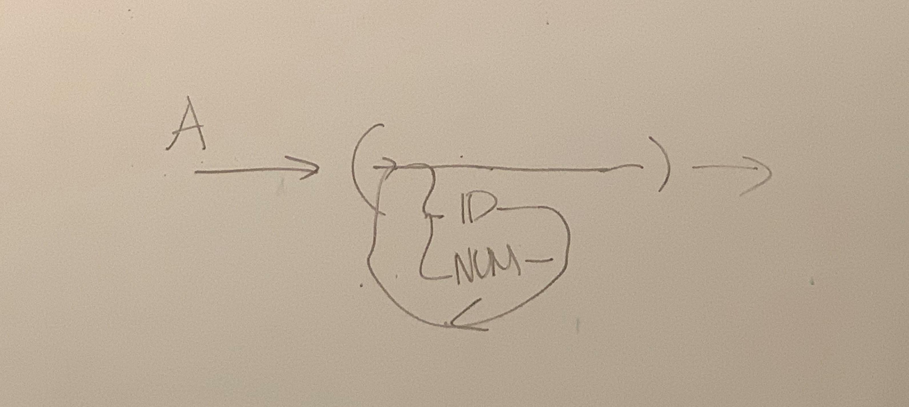

# Lecture 5

Grammars for 

* natural languages
* programming languages
* data format
* grammars themselves

## Syntax Graphs

* Motivation: textual representations for grammar too confining and hard to understand
* Use: large grammars for less-common language
  * e.x. SQL variant for DB2

### Ex. text grammar for a bit for Scheme

```
<cond> -> (cond <cond clause>+)
             |  (cond <cond clause>* (else <sequence>))
```

The above grammar uses metanotations and EBNF to clarify grammars in text.

Syntax diagram \(for the above grammar\):



You can make multiple grammars into one diagram:

```
A -> (B*)
B -> ID|NUM
```



flowchart for a parser for cond

Parsing the simple diagram example:

```
bool parse_cond (void) {
    if (gettok() != '(')
        return false;
    if (gettok() != COND)
        return false;
    if (parse_cond_clause()){
        while (parse_cond_clause())
            continue;
        if (gettok() != ')')
            return false;}
    else{
        if ()
    }
    return true;
}    
```

At each stage, you look for a token, or fail

* Question: is it a finite state machine?
  * Almost
  * while \(parse\_cond\_clause\(\)\) -&gt; goes to a stack, so it is not finite, since a stack can go large
  * This is a Finite State Machine \(FSM\) + Stack
  * pushdown automata

### Problem with parsers

* Recursion

  ```
  A -> A -> .... A
  ```

  * grammars are naturally recursive, so parses have to be recursive too
  * recursive thinking looks unnatural for most people.

* Alternation \(OR\)

  ```
  A -> B|C|D|...
  ```

  * For example, at stage 3, we need to pick a way to go to get a correct parse
  * when you have a choice, how do you pick

* Concatenation

  ```
  A -> BCD...

  ```

### HW2 Hints

```
fragment = token list (    )
acceptor = fragment -> fragment option 
matcher = acceptor -> fragment -> fragment option
unmatched suffix
matcher = acceptor -> acceptor


(* discriminant union *)
type 'a option = 
    | None 
    | Some of 'a
```

#### Matchers

* non-terminals

\(**Recursion**\)

```
A -> aA
============================================
[fun acceptor -> 
     (   fun frag -> 
           acceptor frag )]
```

```
(*some simplification tricks*)
fun x -> f x 
<=> f

let a = 3 in a+5
<=> let 3+5

fun x -> (g h i)x
<=> g h i

fun x -> (f x) y
(*We CANNOT simplify this, because after getting fx,
we use the result to do more things with y*)

let match_never accept frag -> None
<=> let match_never _ _ -> None
```

```
(*How to parse a empty condition*)
A -> [fun acceptor -> acceptor]    (*identity fun*)
```

```
(*How to parse a single token t*)
B -> t 
============================================
fun acceptor ->
    fun frag -> 
        match frag with
        | T"t"::s -> acceptor s
        | _ -> None
==============================================
fun acceptor ->function
    | T"t"::s -> acceptor s
    | _ -> None
```

\(**Alternation**\)

```
(*How to parse an OR-condition*)
C -> D
C -> E
==============================================
(*Compute the match for C*)
(*In this code, you have to assume you know
the matchers for D and E*)
let mc = 
fun accept -> 
    fun frag -> 
    let r = mD accept frag in
        match r with 
        | Some x -> Some x
        | None -> mE accept frag 
(*terminals or non-terminals does not matter in 
this case*)

```

\(**Concatenation**\)

```
F -> GH    (*mG mH*)
        sG   s
frag: G | H | suffix
=============================================
let mF = fun accept -> 
 fun frag ->
    let aG = (fun sG -> 
         mH accept sG)
    in mG aG frag
=======simplification========================
let mF = fun accept ->
     mG (func sG -> mH accept sG)
=======more simplification===================
let mF = fun accept ->
     mG (mH accept)
```

```
A -> BCDE
A -> 
fun pattern list -> matcher
=============================================
let mmfcpl = function 
    | [] -> id (*for empty list*)
    | p::ps -> 
        let mp = make_matcher p 
        and mps = mmfcpl ps
        in fun accept -> mp (mps accept)
        
```

```
C -> D
C -> E
C -> F
...
==============================================
let mmds = function
    | [] -> match_never
    | p::ps -> 
        let mp = make_matcher p 
        and mps = mmds ps
        in (fun sccept -> fun frag -> 
         match mp accept frag with
            | None -> mps accept frag
            | x -> x)
```

## Patterns

```
match E with
  | P1 -> E1
  | Pi -> Ei
  ...
  | Pn -> En
```


Patterns act like expressions, but are not expressions. 

Patterns nest, and bind values


Some patterns:

* 0, 1 \(constants\), \[ \] -&gt; simple: matches only that value
* x \(id\) -&gt; always match, binds id to value
* p1, p2 -&gt; matches pairs \(p1 match 1st, p2 match 2nd\)
* p1::p2 -&gt; p1 match head, p2 match rest
* \[p1,p2,\(p3,p4\)\] 
* Some P

